# **Harry Potter Book Quiz - Project Portfolio 2 - Javascript**

Harry Potter Book Quiz is an interactive online quiz for users who would like to test their book knowledge of the Harry Potter universe in a fun, and challenging way, with a means to choose the quiz difficulty and caluclate the score and compare it to previous highscores.

You can view the live site here - <a href="https://rhiannonmcn.github.io/Harry-Potter-Quiz/" target="_blank"> Harry Potter Book Quiz </a>

# Contents

* [Objective](<#objective>) 
* [User Experience](<#user-experience-ux>)
    * [Site Aims](<#site-aims>)
    * [User Stories](<#user-stories>)
    * [Design Wireframes](<#design-wireframes>)
    * [Site Structure](<#site-structure>)
    * [Design Choices](<#design-choices>)
    *   [Colour Scheme](<#colour-scheme>)
    *   [Typography](<#typography>)
* [Features](<#features>)
* [Future Features](<#future-features>)
* [Technologies Used](<#technologies-used>)
* [Testing](<#testing>)
    * [Code Validation](<#code-validation>)
    * [Lighthouse Testing](<#lighthouse-testing>)
    * [Responsive Testing](<#responsive-testing>)
    * [Accessibility Testing](<#accessibility-testing>)
    * [Manual Testing](<#manual-testing>)
    * [Bugs Fixed](<#bugs-fixed>)
* [Deployment](<#deployment>)
* [Credits](<#credits>)
* [Acknowledgements](<#acknowledgements>)

# Objective

[Back to top](<#contents>)

# User Experience (UX)

## Site Aims

* To provide the user with an interactive quiz to test their knowledge on the subject of the Harry Potter Books.
* To create a quiz that encourages the user to start again to improve their score.
* To provide a quiz that is fully responsive so the user can play across multiple platforms.
* To provide an interactive experience that is easy to navigate and understand.
* To provide an experience that is enjoyable but still challenging to the user so that they will do the quiz again.

## User Stories

The **user** is any person who has read the Harry Potter book series (1-7) and would like to test their Harry Potter book knowledge.

| ID | ROLE | ACTION | GOAL |
|-----------------|:-------------|:---------------:|:---------------:|
| 1 | USER | As a user, I want to be able play the Harry Potter Quiz| So I can test my knowledge|
| 2 | USER | As a user, I want to be able to navigate around the interface easily | so it doesn't take me out of the experience|
| 3 | USER | As a user, I want to be able to play the quiz across all devices | So I can play the quiz while on the go or in different locations |
| 4 | USER | As a user, I want the option of a more difficult quiz | So I can challenge myself  |
| 5 | USER | As a user, I want to be able to start the game when I am ready | So I can prepare myself |
| 6 | USER | As a user, I want to be track my score | So I can improve on it |
| 7 | USER | As a user, I want to see the right answer highlighted if I answer wrong | So I can see where I went wrong |
| 8 | USER | As a user, I want to be able to start a new game when the current one ends | So I can see if I can beat my score|
| 9 | USER | As a user, when I play the quiz I want the questions to be randomly ordered | So the game can be as challenging as possible |

## Design Wireframes

 
 Low fidelity desktop wireframes

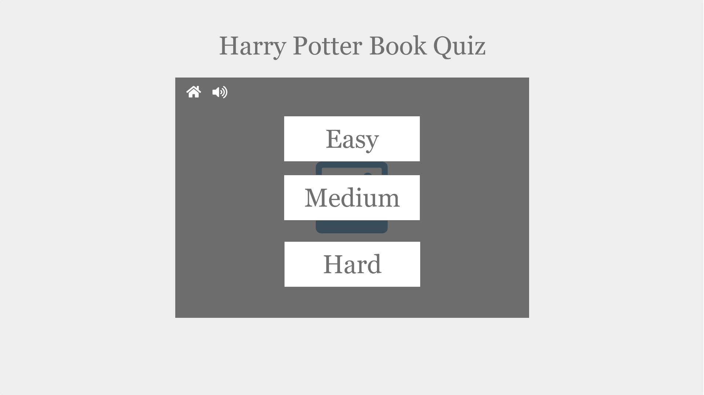

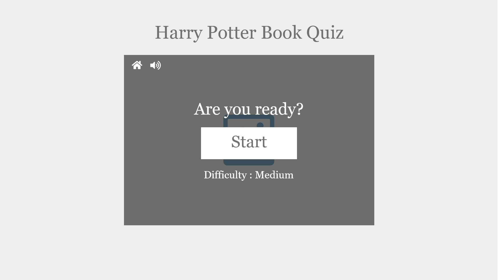

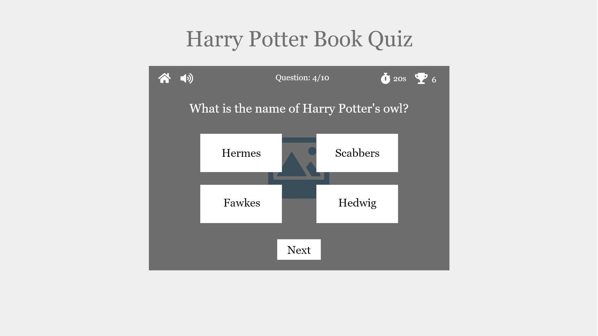

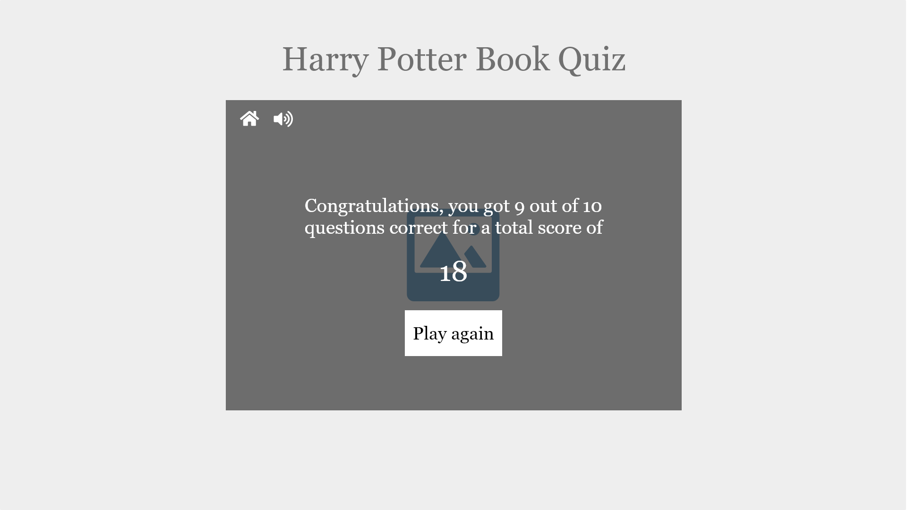

 
 Low fidelity tablet wireframes

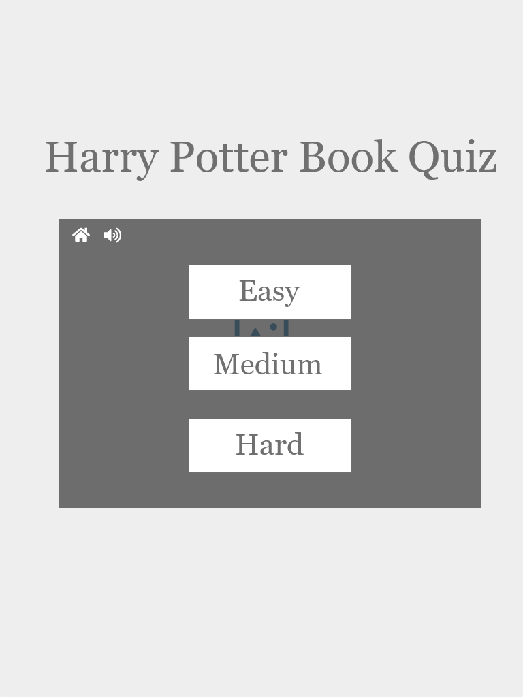

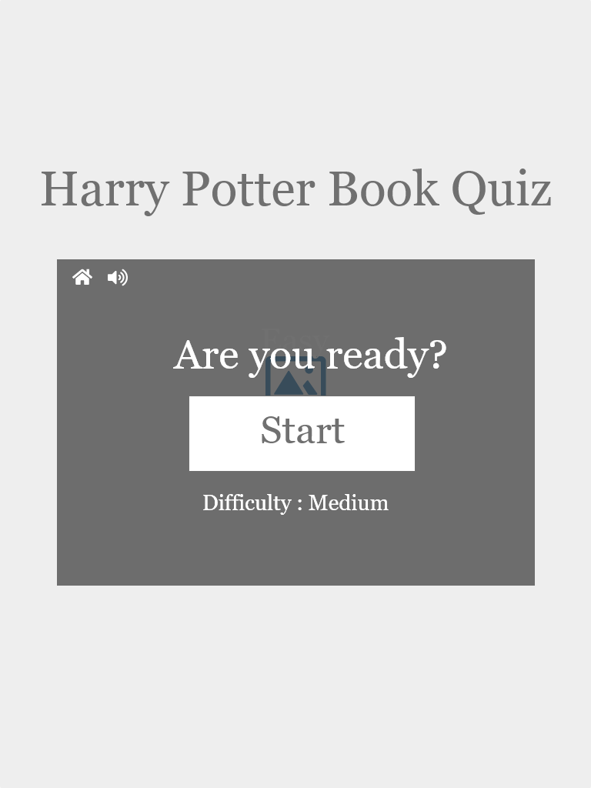

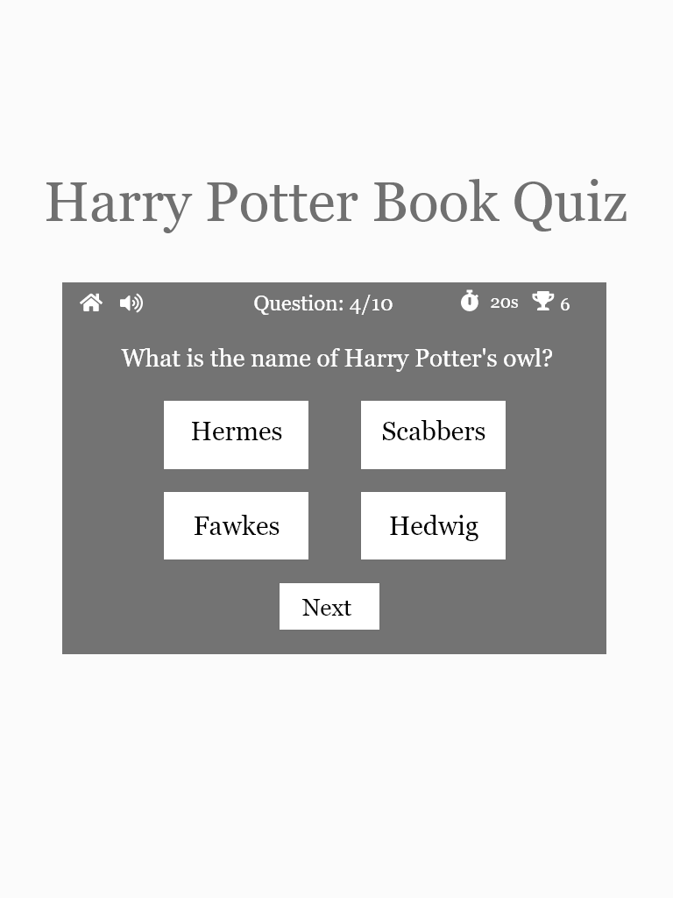

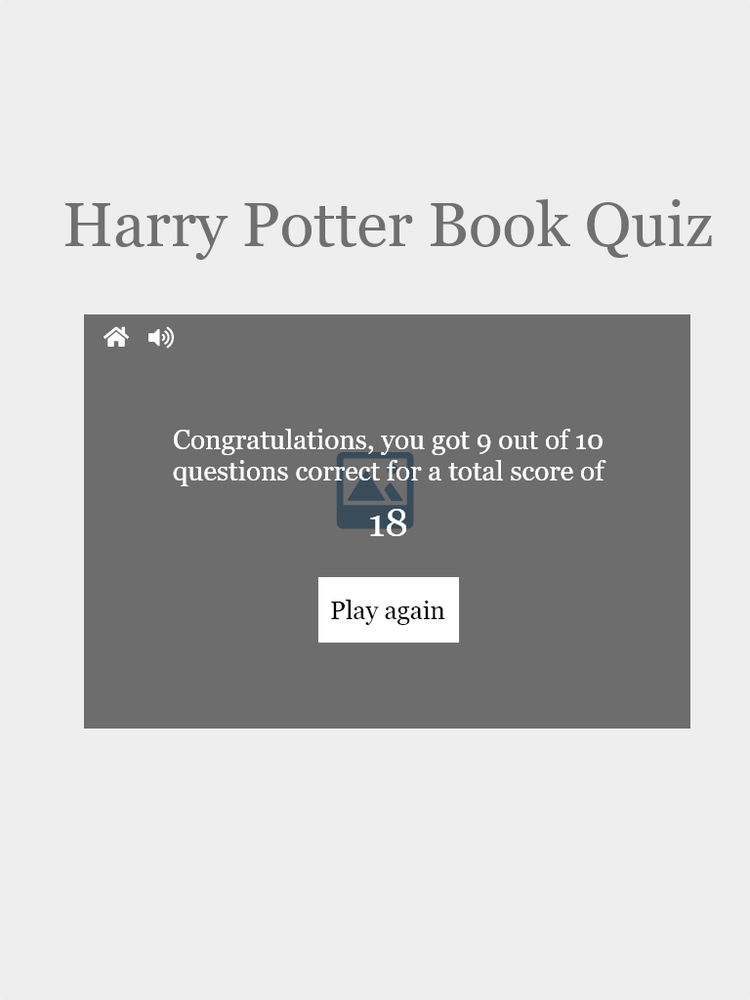

 
 Low fidelity phone wireframes

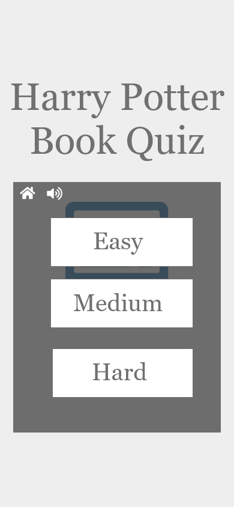

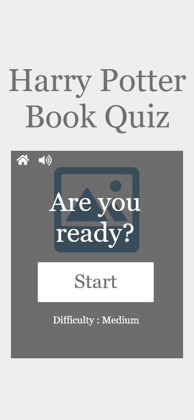

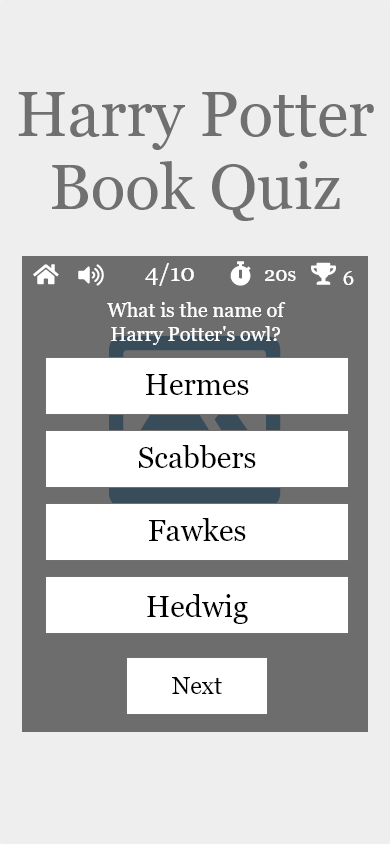

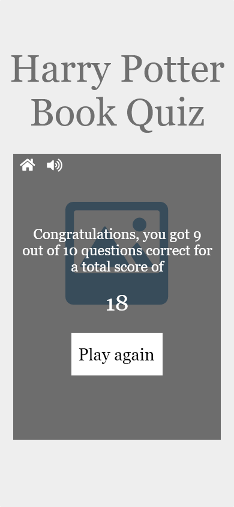

## Site Structure

Harry Potter Online Quiz consists of a one page site with 5 different 'screens' and an optional 6th screen, that the user navigates through to engage with the quiz. The Home screen offers two navigation paths, one to enter the quiz and another to see the highscores. Each screen has an information bar with information and controls on it; the home page button is to the immediate left and the sound icon toggles the sound on and off is right beside it. When the user progresses to the actual quiz, the bar is filled with a timer, counting down how long the user has to answer the questions and a score which tallies the user's score as they progress through the quiz. Upon finishing the quiz you the user is immediately taken to the results screen that gives the option to navigate to the optional 6th screen which is the highscores screen which can also be accessed from the home screen or to go to the home page.

## Design Choices

### Colour Scheme

The final colour scheme chosen was a rich dark red colour, with a warm, cream colour for the text and a mid grey colour as an accent. This colour scheme directly links back with the theme of the project: Harry Potter. Red is often associated with Harry Potter, the main character, because of his association with the Gryffindor house, who's colour is red or scarlet. The grey and cream colours are a nod to the main setting of the books, which is a castle, and the magical community's main ways of communication which tends to be a bit old fashioned in it's use of parchment and quills. 

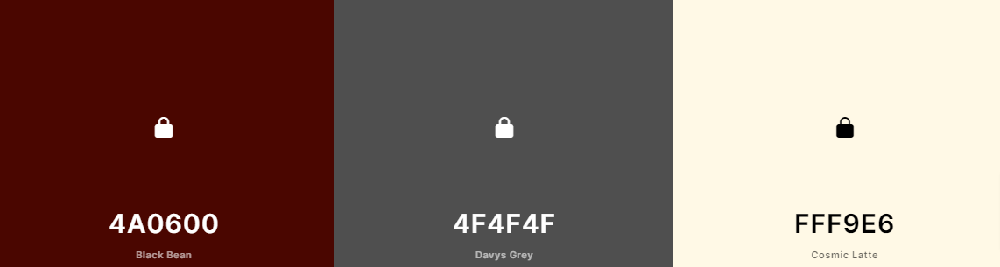

### Typography

The fonts chosen were Cinzel for the main heading text and Prata for the subsequent heading and body text. Sans-serif is the fallback font. 

Both fonts are a serif font and tie nicely with the theme of the quiz. There is a slight vintage feel to both fonts, with the use of letter spacing to give it a clean feel.

[Back to top](<#contents>)

# Features

The Harry Potter Online Book Quiz is created to produce an immersive experience for the user through the use of both design and site structure. It moves away from a typical website structure with the a menubar and is structured and designed more like a game.

It is intuitively designed so the user can navigate it with ease, with visible and recognisable Home and Sound button icons, and visual ques and sound effects reflecting the topic.

## Navigation

* The site navigation is done through the info bar at the top of the game area.
* This does not change in style throughout the user's navigation of the quiz.
* The home button is an icon of a castle, a nod to the theme itself while still being recognisable as a 'home' button. 
* The position of the Home button does not move throughout the user's navigation of the quiz.
* The sound button is automatically muted on website loading and like the home button it's position doesn't move.
* On the quiz run through two more bits of information are added to the right of these: the timer countdown and the user's score.
* The navbar is responsive and does not change order throughout screen size changes.

[Back to top](<#contents>)

# Future Features

# Technologies Used

[Back to top](<#contents>)

# Testing

## Code Validation

## Lighthouse Testing

## Accessibility Testing

## Responsive Testing

## Manual Testing

## Bugs Fixed
https://stackoverflow.com/questions/63421963/on-click-get-button-values-from-array-javascript

[Back to top](<#contents>)

# Deployment

The website was deployed to GitHub pages via the following methods:

1. Navigate to the Settings tab in the GitHub repository for the project.
2. On the left hand side, scroll down to the pages tab.
3. Under the Source tab, choose the branch called Main and in the dropdown beside it select the folder called Root.
4. Click save.
5. The page automatically displays the deployed link at the top once save is clicked.
6. It can take up to 5 minutes to deploy.

[Back to top](<#contents>)

# Credits

* [Hogwarts Crest image](https://commons.wikimedia.org/wiki/File:Hogwarts-Crest.png)
*[3D CSS effect in h1](https://codepen.io/ryandsouza13/pen/yEBJQV)
https://www.sitepoint.com/simple-javascript-quiz/
https://www.codingnepalweb.com/quiz-app-with-timer-javascript/
https://www.youtube.com/watch?v=riDzcEQbX6k&t=1419s&ab_channel=WebDevSimplified
https://stackoverflow.com/questions/54753424/how-to-keep-score-for-questions-answered-correct-and-deduct-points-for-questions
https://www.youtube.com/watch?v=jfOv18lCMmw&list=PLB6wlEeCDJ5Yyh6P2N6Q_9JijB6v4UejF&index=9&ab_channel=JamesQQuick
https://stackoverflow.com/questions/4435776/simple-clock-that-counts-down-from-30-seconds-and-executes-a-function-afterward
https://www.youtube.com/watch?v=eHn8eF0nwD0&ab_channel=KenezNonwar
https://stackoverflow.com/questions/37115491/how-to-set-volume-of-audio-object
https://stackoverflow.com/questions/13610638/loop-audio-with-javascript
https://www.zapsplat.com/
https://stackoverflow.com/questions/14718561/how-to-check-if-a-number-is-between-two-values

[Back to top](<#contents>)

# Acknowledgements

[Back to top](<#contents>)
