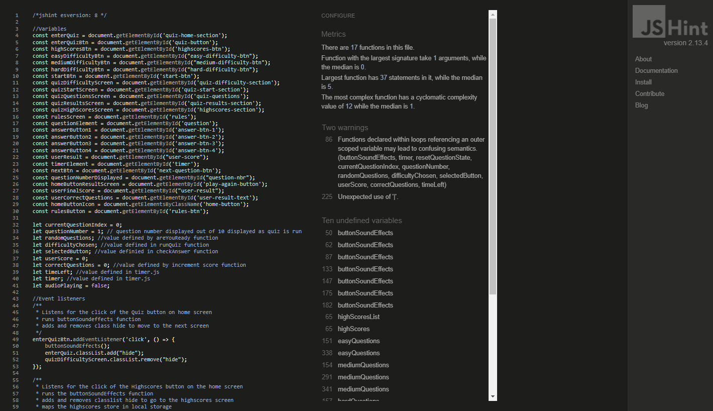
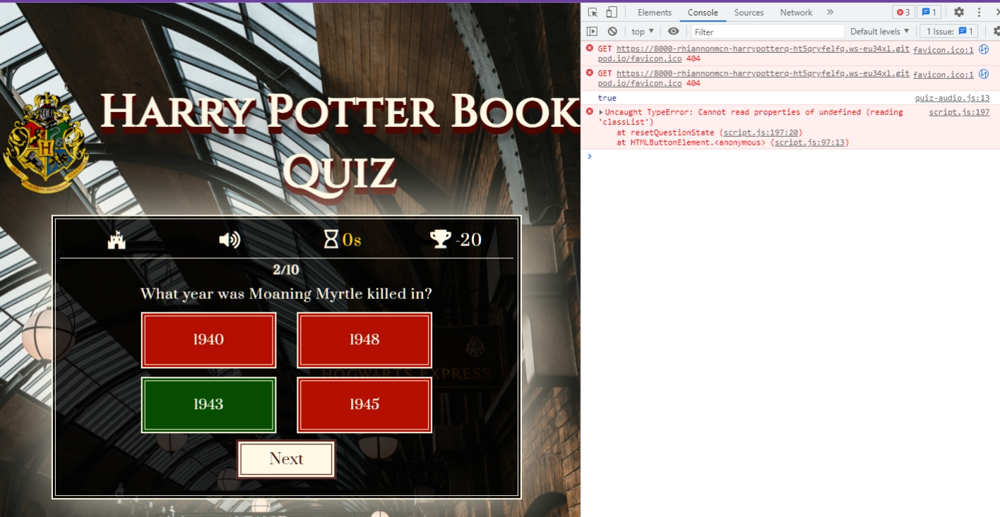

# **Harry Potter Book Quiz - Project Portfolio 2 - Javascript**

Harry Potter Book Quiz is an interactive online quiz for users who would like to test their book knowledge of the Harry Potter universe in a fun, and challenging way, with a means to choose the quiz difficulty and caluclate the score and compare it to previous highscores.

You can view the live site here - <a href="https://rhiannonmcn.github.io/Harry-Potter-Quiz/" target="_blank"> Harry Potter Book Quiz </a>

# Contents

* [Objective](<#objective>) 
* [User Experience](<#user-experience-ux>)
    * [Site Aims](<#site-aims>)
    * [User Stories](<#user-stories>)
    * [Design Wireframes](<#design-wireframes>)
    * [Site Structure](<#site-structure>)
    * [Design Choices](<#design-choices>)
    *   [Colour Scheme](<#colour-scheme>)
    *   [Typography](<#typography>)
* [Features](<#features>)
* [Future Features](<#future-features>)
* [Technologies Used](<#technologies-used>)
* [Testing](<#testing>)
    * [Code Validation](<#code-validation>)
    * [JSHint](<#jshint>)
    * [Lighthouse Testing](<#lighthouse-testing>)
    * [Accessibility Testing](<#accessibility-testing>)
    * [Responsive Testing](<#responsive-testing>)
    * [Manual Testing](<#manual-testing>)
    * [Bugs Fixed](<#bugs-fixed>)
* [Deployment](<#deployment>)
* [Credits](<#credits>)
* [Acknowledgements](<#acknowledgements>)

# Objective

[Back to top](<#contents>)

# User Experience (UX)

## Site Aims

* To provide the user with an interactive quiz to test their knowledge on the subject of the Harry Potter Books.
* To create a quiz that encourages the user to start again to improve their score.
* To provide a quiz that is fully responsive so the user can play across multiple platforms.
* To provide an interactive experience that is easy to navigate and understand.
* To provide an experience that is enjoyable but still challenging to the user so that they will do the quiz again.

## User Stories

The **user** is any person who has read the Harry Potter book series (1-7) and would like to test their Harry Potter book knowledge.

| ID | ROLE | ACTION | GOAL |
|-----------------|:-------------|:---------------:|:---------------:|
| 1 | USER | As a user, I want to be able play the Harry Potter Quiz| So I can test my knowledge|
| 2 | USER | As a user, I want to be able to navigate around the interface easily | so it doesn't take me out of the experience|
| 3 | USER | As a user, I want to be able to play the quiz across all devices | So I can play the quiz while on the go or in different locations |
| 4 | USER | As a user, I want the option of a more difficult quiz | So I can challenge myself  |
| 5 | USER | As a user, I want to be able to start the game when I am ready | So I can prepare myself |
| 6 | USER | As a user, I want to be track my score | So I can improve on it |
| 7 | USER | As a user, I want to see the right answer highlighted if I answer wrong | So I can see where I went wrong |
| 8 | USER | As a user, I want to be able to start a new game when the current one ends | So I can see if I can beat my score|
| 9 | USER | As a user, when I play the quiz I want the questions to be randomly ordered | So the game can be as challenging as possible |

## Design Wireframes

 
 Low fidelity desktop wireframes

 
 Low fidelity tablet wireframes

 
 Low fidelity phone wireframes

## Site Structure

Harry Potter Online Quiz consists of a one page site with 5 different 'screens' and an optional 6th and 7th screen, that the user navigates through to engage with the quiz. The Home screen offers three navigation paths, one to enter the quiz, another to see the highscores and the last is the rules page. Each screen has an information bar with information and controls on it; the home page button is to the immediate left and the sound icon toggles the sound on and off is right beside it. When the user progresses to the actual quiz, the bar is filled with a timer, counting down how long the user has to answer the questions and a score which tallies the user's score as they progress through the quiz. Upon finishing the quiz you the user is immediately taken to the results screen that gives the option to navigate to the optional 6th screen which is the highscores screen which can also be accessed from the home screen or to go to the home page.

## Design Choices

### Colour Scheme

The final colour scheme chosen was a rich dark red colour, with a warm, cream colour for the text and a mid grey colour as an accent. This colour scheme directly links back with the theme of the project: Harry Potter. Red is often associated with Harry Potter, the main character, because of his association with the Gryffindor house, who's colour is red or scarlet. The grey and cream colours are a nod to the main setting of the books, which is a castle, and the magical community's main ways of communication which tends to be a bit old fashioned in it's use of parchment and quills. 

### Typography

The fonts chosen were Cinzel for the main heading text and Prata for the subsequent heading and body text. Sans-serif is the fallback font. 

Both fonts are a serif font and tie nicely with the theme of the quiz. There is a slight vintage feel to both fonts, with the use of letter spacing to give it a clean feel.

[Back to top](<#contents>)

# Features

The Harry Potter Online Book Quiz is created to produce an immersive experience for the user through the use of both design and site structure. It moves away from a typical website structure with the a menubar and is structured and designed more like a game.

It is intuitively designed so the user can navigate it with ease, with visible and recognisable Home and Sound button icons, and visual ques and sound effects reflecting the topic.

## Navigation

* The site navigation is done through the info bar at the top of the quiz area and this does not change in style throughout the user's navigation of the quiz.
* The user can navigate to the home screen from whereever they are in the quiz through the home button. 
* This is an icon of a castle, a nod to the theme itself while still being recognisable as a 'home' button. 
* The sound button is automatically muted on website loading and like the home button it's position doesn't move but sound can be activated or muted by the user as they wish.
* Upon activation, there is themed background music and sound effects on the button clicks.
* On the quiz run through two more bits of information are added to the right of these: the timer countdown and the user's score.
* The navbar is responsive and does not change order throughout screen size changes.

[Back to top](<#contents>)

## Home Screen

* The Home Screen is the screen thats visible first when the site website loads. It is designed to be immediately recognisable to the user and to allow the user to immediately get playing the quiz.
* In the middle of the website, the user will the quiz application centered, sitting upon a very recognisable Harry Potter themed background.
* There is also the title and logo sitting on top of the quiz application, again giving the user the information on what the application is.
* The user is presented with three buttons; a Quiz button, a Highscores button and a Rules button and from here the user has all the information needed to play the quiz.

## Quiz Difficulty Screen

* Navigation to this screen is through pressing the Quiz button on the home screen.
* The quiz has three difficulty levels to choose from and are so named after different Harry Potter exam related material from the books.
* Each difficulty has its' own question pool to choose from, which 10 questions are randomly choosen from.
* Depending on which quiz difficulty is chosen, also determines other features that are implemented.
* Choosing Troll (easy level) will give the user a time of 20 secounds to answer a question and will reward the user 2 points for a correct answer with no penalty for a wrong answer. 
* Choosing O.W.L. (medium level) will give the user a time of 15 secounds to answer the question, will reward the user 5 points for a correct answer but will penalise the user 3 points for every wrong answer or if the timer runs out.
* Choosing N.E.W.T. (hard level) will give the user a time of 10 secounds to answer the question, will reward the user 2 points plus the addition of whatever time is left on the timer for a correct answer. The quicker the user answers the more points they score. But will penalise the user 5 points for every wrong answer or if the timer runs out.

## Quiz Start Screen

* The quiz start screen is simply a phrase "Are you ready?" and a start button which will run the quiz.
* This is to give the user a chance to prepare to take the quiz, to take a mental breath before diving in.

## Quiz Questions Screen - Core of the Application

* This is the heart of the game. The user will be asked to answer 10 questions no matter which difficulty is chosen, which was determined in a previous screen.
* The pool of questions is randomly chosen from a list of questions grouped by question difficulty in the questions.js file.
* Each question is a multiple choice question with four possible answers.
* Each of the answer boxes are also randomly displayed, to challenge the user and prevent memorisation of the answers if the quiz is played a second time.
* Once a question is on the screen, unanswered, the next button functionality is disabled so as to prevent the user from skipping questions and the timer starts.
* Once the timer reaches 5 seconds it will turn a gold colour and if the audio is playing countdown the 5 secounds with an audible sound effect.
* If the user answers a question correctly, a 'correct' sound will be played and the correct answer will highlight in green. The timer will pause and the user will receive points determined by the quiz difficulty chosen. 
* If the user answers a question incorrectly, an 'incorrect' sound will play. The user's answer will highlight in red and the correct answer will highlight in green. The user will not score any points and depending on the difficulty chosen, may be deducted points.
* If the user fails to answer the question within the allotted time, the 'incorrect sound will play', the right answer will highlight in green and the incorrect answers will highlight in red. The user also may be deducted points depending on the quiz difficulty chosen.
* Once a user answers the question or the timer runs out, the answer button functionality is disabled so as to prevent re-answering and the next button functionality is enabled again.

## Results Section

* When the user has looped through ten questions, they will then be automatically brought to the result's screen, which will display the user's score and how many questions out of 10 they got correct.
* There is an input field, a Save score button and a Home Button.
* The input field cannot be submitted empty and upon clicking the save button the user will be notified that they must enter a username to save their score. 
* They also have the option to skip this step and navigate straight to the home screen by clicking the home button.
* Once the user enters a username and clicks save, they are then brought to the high scores screen.

## High Scores Screen

* The High Scores screen can be navigated in two ways. Firstly through the homepage, and the highscores button. And secondly by playing the quiz and saving your score.
* The high scores are stored using local storage and are sorted in descending order and cut off at the first 5 high scores, with the username entered displayed alongside the score.
* The incentive of this feature is to encourage users to beat their previous scores, try the quiz again, play different difficulties and try and beat the timer.
* From the high scores screen, the user can navigate back to the home screen via the home button.

## Rule Screen

* The rules page is navigated to via the home screen.
* This page has very little interactivity, with just a home button bringing you back to the home page.
* This page is to give the user further understanding of the different question difficulties and their unique features.

## Timer

* The timer adds another dynamic layer to the quiz.
* The time given is dependent on the level difficulty chosen (20s, 15s and 10s).
* On the hard difficulty, the time left on the time countdown is added to the users score if they get an answer right, bringing in the users speed into the quiz.
* Once the timer reaches 5 seconds it visibly turns a gold colour, and if the user's sound is on, it starts a 'ticking countdown effect' until 0, warning the user that their time is nearly up.

## Sound

* Sound is muted by default but the user has the option to toggle it on via the sound button on the info bar.
* It gives the user additional feedback as they navigate the quiz.
* Background music really draws the user into the experience.
* There are sound effects for the button clicks, as well as for the correct and wrong answers.
* The timer also countdowns at 5 secounds with a sound effect.
* The user has the ability to toggle the sound on and off as many times as they wish as they navigate the quiz.

## Score

* The score is visibly seen in the top right corner of the info bar of the quiz application.
* It provides an incentive to the user to keep playing the quiz and challenging themselves by trying to beat their last score.
* By providing different scores for different levels of difficulty, as well as implementing unpredictable elements such as adding the time left to the score and deducting points for wrong answers keeps scoring inconsistent in terms of the total score, encouraging users to challenge themselves. 

## Current Question Display

* This feature provides the user with a clear indication of what question number they are on out of the 10.

[Back to top](<#contents>)

# Future Features

## Different Sections

* Including questions targeted at certain books only. Having question pools and sections dedicated only to Book 1, and another question pool dedicated to Book 2 etc. 

## A Harder Difficulty/End Game Content

* Have a level that creates a question index from the entire question pool, but if the user get's one question wrong, their score is saved at that point and they have to start from the beginning again, but the question pool has been randomly shuffled so they wont start with the first question. They wont be limited to just 10 questions but will have the chance to go through all the questions if they can get them all correct. This type of functionality offers long term usability, as with dedicated question pools and question numbers answered, the score can only go so high as the 10 questions right can give you. 

## Global Highscores

* Instead of saving the high scores locally, saving the scores on a global level will raise the level of engagement with the quiz application, as users could compete against other people qhile accessing the application from different devices.

[Back to top](<#contents>)

# Technologies Used

* HTML5 - Delivers the structure and content for the site.
* CSS3 - Provides the styling for the site
* Javascript -Provides functionality to the site
* [Adobe XD](https://www.adobe.com/ie/products/xd.html) - Used to create wireframes for the website
* [Adobe Lightroom](https://www.adobe.com/ie/products/photoshop-lightroom.html) - Used to optimise and resize images for screen.
* [Tiny PNG](https://tinypng.com/) - Used to further compress optimised images.
* Google Chrome DevTools - Used to debug and test responsiveness of the site
* Gitpod - Used to develop the website.
* GitBash - Terminal used to push changes to the GitHub repository.
* Github - Used to host and deploy the website.

[Back to top](<#contents>)

# Testing

## Code Validation

The Harry Potter Book Quiz has been tested via W3C HTML validator and W3C CSS validator. There were a few minor errors that came up for the HTML pages which were immediately corrected and documented down below in [Bugs Fixed](<#bugs-fixed>).

## JSHint

The Javascript files were validated via JSHint. Due to there being multiple Javascript files, validating each page threw up multiple notces, many of which were undefined varibles. This was due to the variables and functions being defined or called on other pages. 

JSHint came up with a lot of undefined variables. However this is because there are multiple javascript pages

JSHint Validation

## Lighthouse Testing

The quiz was also put through Lighthouse testing via Chrome DevTools which tests the site under 4 different headings; Performance, Accessibility, Best Practices and SEO and it tests it under mobile and desktop criteria.

## Accessibility Testing

A11y was used to test the color contrast of the website for accessibility purposes and it passed.

Adobe Color was used to test that the color scheme was accessible for people with different types of blindness, which it also succeeded in doing.

## Responsive Testing

Responsiveness was tested via a few different mediums manually, including Chrome Devtools, The Viewport Resizer chrome extension and The Responsive Design Checker website.

## Manual Testing

In addition to the automated process above, manual testing was carried out on the site as well.

* Home Screen
    * Verified that clicking the Home Button icon on the info-bar brought the user back to the home screen.
    * Verified that toggling the audio button will toggle the audio on and off as many times as the user presses it.
    * Verfied that the Quiz button takes the user to the Difficulty screen.
    * Verified that the High Scores button brings the user to the High Scores screen.
    * Verified that the Rules button brings the user to the rules screen.
    * Verified that all sounds work if the sound is toggled on; background music and button clicks.

* Difficulty Screen
    * Verified that clicking the Home Button icon on the info-bar brought the user back to the home screen.
    * Verified that toggling the audio button will toggle the audio on and off as many times as the user presses it.
    * Verified via console.log that pressing the Troll button difficulty accesses the easy difficulty questions and randomly sorts them and takes the user to the Start Quiz screen.
    * Verified via console.log that pressing the O.W.L. button accesses the medium difficulty questions and randomly sorts them and takes the user to the Start Quiz screen.
    * Verified via console.log that pressing the N.E.W.T. button accesses the hard difficulty questions and randomly sorts and takes the user to the Start Quiz screen.
    * Verified that all sounds work if the sound is toggle on; background music and button clicks.

* Start Quiz Screen
    * Verified that clicking the Home Button icon on the info-bar brought the user back to the Home screen and reset the quiz choices made so far.
    * Verified that toggling the audio button will toggle the audio on and off as many times as the user presses it.
    * Verified via console.log that the users selected question level difficulty was still correct prior to pressing the start button.
    * Verified that pressing the Start button brings the user to the Quiz Questions Screen.
    * Verified that all sounds work if the sound is toggled on; background music and button clicks.

* Quiz Questions Screen
    * Verified that clicking the Home Button icon in the info-bar brought the user back to the Home screen and reset the entire quiz, including users previous choices and answers.
    * Verified that toggling the audio button will toggle the audio on and off as many times as the user presses it.
    * Verified that the question displayed correctly with the correct answer buttons also displayed.
    * Verified via console.log that the current question displayed matched the question index question.
    * Verified that the timer showed up in the info-bar correctly and started on loading of the question. That it was displayed properly, that the correct amount of time was counted down depending on the difficulty chosen and that the timer stopped if an answer was chosen or time ran out and that the timer cleared and restarted upon pressing the next button.
    * Verified that the score icon shows up correctly in the info-bar, that it increments by the correct amount depending on the difficulty chosen. That the score deducts by the correct amount depending on the difficulty shown, and that the score is displayed correctly at all times.
    * Verified that the question number is displayed correctly, and that it increments currently.
    * Verified that the questions are iterated through 10 times before bringing to the results page via the next button.
    * Verified that all sounds work if the sound is toggled on; background music, button clicks, sound for the correct answer, sound for the wrong answer and sound for the timer countdown st 5 secounds.

* Results Screen
    * Verified that clicking the Home button icon on the info-bar brought the user back to the Home screen and resets the entire quiz, including the users previous choices and answers. 
    * Verified that toggling the audio button will toggle the audio on and off as many times as the user presses it.
    * Verified that the message is displayed correctly with the number of correct questions the user had and their final score is displayed correctly.
    * Verified that save button cannot be activated if the username input is empty and that it throws up a notification to the user if pressed while the input is empty.
    * Verified that the save button takes the user to the High Scores page.
    * Verified via DevTools and console.log that the username and score is saved in local storage on click of the save button.
    * Verified that the Home button brings the user back to the home page and resets the entire quiz, including the users previous choices and answers and that the users score is not saved if the home button is clicked.
    * Verified that all sounds work if the sound is toggled on; background music and button clicks.

* High Scores Screen
    * Verified that clicking the Home button icon on the info-bar brought the user back to the Home screen and resets the entire quiz, including the users previous choices and answers. 
    * Verified that toggling the audio button will toggle the audio on and off as many times as the user presses it.
    * Verified through multiple plays of the quiz and saving high scores that the highscores are indeed saved, sorted into descending order and cut off at 5 high scores and that any new high scores in the top 5 replace the lowest score that was previously visible.
    * Verified that the Home Button takes the user to the home screen and resets the quiz fully.
    * Verified that all sounds work if the sound is toggled on; background music and button clicks.

* Rules Screen
    * * Verified that clicking the Home button icon on the info-bar brought the user back to the Home screen.
    * Verified that toggling the audio button will toggle the audio on and off as many times as the user presses it.
    * Verified that the rules were displayed properly.
    * Verified that the Home Button takes the user to the home screen.
    * Verified that all sounds work if the sound is toggled on; background music and button clicks.

* Quiz Reset
    * Verfied that once the quiz is finished and whether the user decides to save their score or go straight back to the home page, that the entire quiz reset; timer, score, quiz difficulty, quiz question randomising, correct question number and the current question number the user is on - and would loop perfectly again, with just the user audio options remaining the same and the high scores saved.

* Resonisiveness
    * Verified manually by playing through each page of the quiz that the quiz was fully responsive on the devices available in DevTools and any other devices that were available to actually test on.

* Browser Testing
    * Harry Potter Book Quiz has been tested manually in Google Chrome, Microsoft Edge, Mozilla Firefox and Safari on both desktop and mobile.
    * Verified that the design and structure was consistent across all browsers.

* Branches
    * Different branches were used to test blocks of code/mass code changes without messing with the integrity of the already working code.

    
    

## Bugs Fixed

### Silent Error

The most difficult error that presented itself was upon completing the quiz and trying to restart it, i.e. resetting variables and clearing timers. However something was breaking and yet no errors were showing up in the console. Using console.log showed results that were expected upon the restart of the quiz, variables seemed to be clearing. But the timers seemed to be counting down doubly (called twice/or not being cleared and called again), same with the question number counter and the user score. The easy solution was to use a window.location.reload, however this took the user from the experience as it also reset the user's sound settings and caused a visual reload.

This bug was clearly a logical error in where the code was situated and called. Once the code was shifted, console.log and DevTool were used to track the variable results and functions called and the correct order for the reset was soon found.

### Timer Delay

There was a slight delay in the visual of the timer showing on screen and it starting, so the timer started before the visual loaded and thus the user saw 9s rather than 10s etc. 

This wasn't an error as such but the logical order in which the code was being called was the cause for the delay. A simple code switch solved this problem, by taking the countdown function out of the setInterval solved this issue.

### Stylesheet Conflicts

After testing, certain styles on the font awesome icons were not showing. DevTools was used to troubleshoot the problem. It could be seen that the syles in styles.css were being overwritten by another styles sheet. 

Making sure that the link for the the font awesome icons was above the link to the styles.css in index.html sorted out the issue as styles.css then became priorty in terms of any styles written.

### Screen Broken

During testing by the average user, I was alerted to a bug which cause the screen to break if the home button icon in the info bar is pressed, in the Start Screen only. It would bring the user home and reset the quiz, however it failed to 'hide' the Start Screen and appended the screen onto the bottom of the Home Screen and onto any other screen thereafter. The problem was easily replicated.

Screen Split Bug

Upon identifying the code visually, it was easy to tell exactly where the code was broken/incorrect. The 'hide' class was being added to the wrong html container, and once amended to the correct container, the screen worked correctly.

### Screen Orientation Responsiveness

Upon completing the Quiz, the code worked perfectly and naturally on desktops, tablets and mobile phones. However, for the most part, this was for portrait orientation of the tablets and mobile phones.  Responsiveness was not as tight in landscape orientation.

After a lot of research on the issue [here](https://developer.mozilla.org/en-US/docs/Web/API/CSS_Object_Model/Managing_screen_orientation), CSS queries were used to tighten responsiveness using the orientation property of portrait and landscape to be very specific.

### Console Error

One console error that kept cropping up was the error as seen below in the screenshot, when inspecting the site for errors via DevTools. Upon a bit of research it was quickly recognised that the error was solved by adding a favicon to the site.

[Back to top](<#contents>)

### Version Control

At one stage, changes were made to timer.js that completely broke the quiz. While it was thought the changes were reset, it still seemed to be broken. Because of this, using version control we could go back to a stage where timer.js was working correctly and use the previous code which worked.

# Deployment

The website was deployed to GitHub pages via the following methods:

1. Navigate to the Settings tab in the GitHub repository for the project.
2. On the left hand side, scroll down to the pages tab.
3. Under the Source tab, choose the branch called Main and in the dropdown beside it select the folder called Root.
4. Click save.
5. The page automatically displays the deployed link at the top once save is clicked.
6. It can take up to 5 minutes to deploy.

[Back to top](<#contents>)

# Credits

* [Hogwarts Crest image](https://commons.wikimedia.org/wiki/File:Hogwarts-Crest.png)
*[3D CSS effect in h1](https://codepen.io/ryandsouza13/pen/yEBJQV)
https://www.sitepoint.com/simple-javascript-quiz/
https://www.codingnepalweb.com/quiz-app-with-timer-javascript/
https://www.youtube.com/watch?v=riDzcEQbX6k&t=1419s&ab_channel=WebDevSimplified
https://stackoverflow.com/questions/54753424/how-to-keep-score-for-questions-answered-correct-and-deduct-points-for-questions
https://www.youtube.com/watch?v=jfOv18lCMmw&list=PLB6wlEeCDJ5Yyh6P2N6Q_9JijB6v4UejF&index=9&ab_channel=JamesQQuick
https://stackoverflow.com/questions/4435776/simple-clock-that-counts-down-from-30-seconds-and-executes-a-function-afterward
https://www.youtube.com/watch?v=eHn8eF0nwD0&ab_channel=KenezNonwar
https://stackoverflow.com/questions/37115491/how-to-set-volume-of-audio-object
https://stackoverflow.com/questions/13610638/loop-audio-with-javascript
https://www.zapsplat.com/
https://stackoverflow.com/questions/14718561/how-to-check-if-a-number-is-between-two-values
https://stackoverflow.com/questions/31106189/create-a-simple-10-second-countdown
https://www.codegrepper.com/code-examples/javascript/20+second+countdown+timer+html
https://developer.mozilla.org/en-US/docs/Learn/JavaScript/Asynchronous/Timeouts_and_intervals
https://siongui.github.io/2012/10/12/javascript-toggle-sound-onclick/
https://stackoverflow.com/questions/27368778/how-to-toggle-audio-play-pause-with-one-button-or-link
https://stackoverflow.com/questions/52738241/my-quiz-count-down-timer-not-working-as-expected
https://stackoverflow.com/questions/63421963/on-click-get-button-values-from-array-javascript

[Back to top](<#contents>)

# Acknowledgements

[Back to top](<#contents>)
